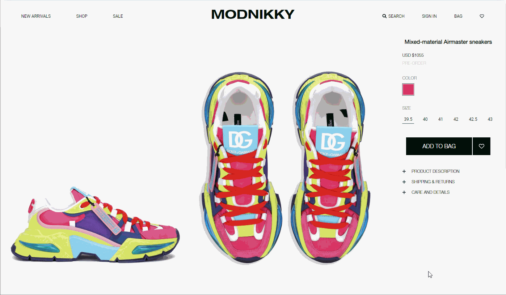

# MODNIKKY (Online Shop)
The MODNIKKY is a virtual store on the Internet where customers can browse the catalog and select products of interest. The selected items may be collected in a Shopping Cart or can be marked as Favorites.

## Design

Project development based on the [design template](https://www.figma.com/file/DE7if8NXsdPQnhGXcb61Gf/MODNIKKY).
The design was created for a wide range screen resolution (desktop: 2880 × 1674; mobile: 850 × 1576).

## Interesting technical solutions
#### Slider with a list of products obtained from the API, with Blur, Parallax, Gradient effects.

#### 3D-scroll effect section with scrolling animation

#### Image-magnifier

## Technologies
* HTML5
* CSS3, Styled Components
* JavaScript
* React, React Hooks, React Router
* Redux, Redux Saga, Redux Actions
* Rest API
* Eslint + prettier
